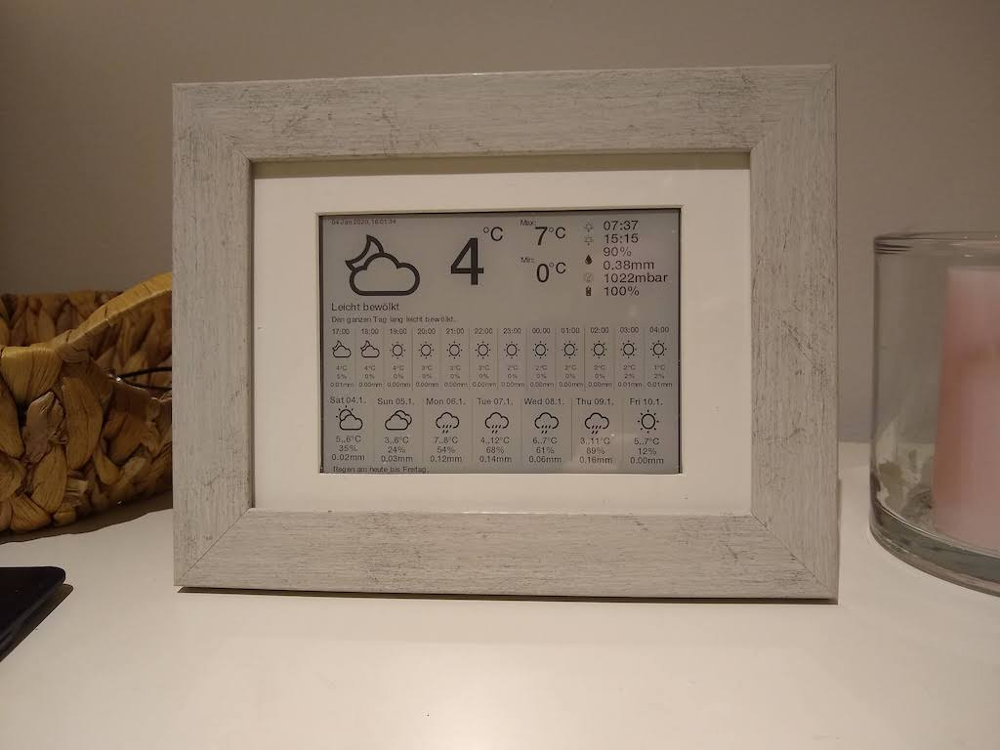

# Kindle Weatherstation

This is a serverless implementation of a weatherstation for the Kindle (PW2)
that is also optimized for battery runtime (~ a month).

The Kindle fetches weather data from DarkSky every 60 minutes, creates a SVG file
based on a template, converts the SVG to PNG, displays the newly generated PNG and
goes to sleep (STR/suspend to RAM) for the remaining time.

* weather2svg.py: Queries weather data and assembles a SVG file based on template
* create-png.sh: Gets data, converts svg file to png and compresses png file
* kindle-weather.sh: Main loop, gets and displays data, suspend to RAM and wakeup
* weather-preprocess.svg: SVG template
* config.xml: KUAL config file
* menu.json: KUAL config file
* sync2kindle.sh: rsyncs all files to Kindle, helps during development/debugging

[rsvg-convert](https://github.com/ImageMagick/librsvg) and [pngcrush](https://pmt.sourceforge.io/pngcrush/) binaries and libs are included.

### Kindle preparation:
* hack the kindle (doh!)
* Install KUAL
* add USBnetworking and python (via MPRI)

### Installation:
* Adjust key and location in `config.py`
* create directory /mnt/us/extensions/weatherstation
* copy everything to the newly created directory (or use sync2kindle.sh)

### Stopping weatherstation:
* Either press button, quickly login and do a `killall pngcrush`
* Or force reboot kindle by holding powerbutton ~10 seconds

## Credits:
* Building on ideas and code from
 * https://mpetroff.net/2012/09/kindle-weather-display/ and
 * https://github.com/nicoh88/kindle-kt3_weatherdisplay_battery-optimized
* Using icons from https://github.com/rickellis/SVG-Weather-Icons
